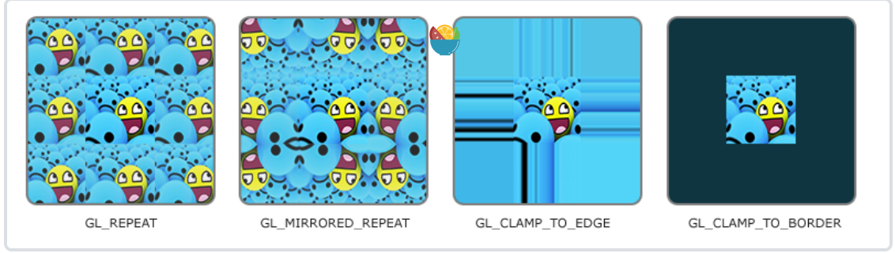

### 纹理

纹理可以看一个贴图，为了将纹理映射到网格上，我们可以指定每个顶点对应的纹理的那部分，即**纹理坐标**，之后光栅化的时候就会进行片段**插值**，片段与纹理坐标建立了一一对应的关系后，我们就能或其纹理上存储的数据，即**采样**。


### 纹理环绕方式
纹理环绕方式，决定了超出纹理坐标下的纹理采样，默认Opengl是重复
但也给我们提供了更多选择
|环绕方式 |描述| 
|---|---|
|GL_REPEAT|对纹理的默认行为。重复纹理图像|
|GL_MIRRORED_REPEAT|和GL_REPEAT一样，但每次重复图片是镜像放置的。|
|GL_CLAMP_TO_EDGE|纹理坐标会被约束在0到1之间，超出的部分会重复纹理坐标的边缘，产生一种边缘被拉伸的效果。|
|GL_CLAMP_TO_BORDER|超出的坐标为用户指定的边缘颜色。|

前面所有的选项都可以通过使用glTexparameter*函数对每个单独的坐标设置(s,t,如果三维还有r，等价与x,y,z)
```c++
glTexParameteri(GL_TEXTURE_2D, GL_TEXTURE_WRAP_S, GL_MIRRORED_REPEAT);
glTexParameteri(GL_TEXTURE_2D, GL_TEXTURE_WRAP_T, GL_MIRRORED_REPEAT);
```
###纹理过滤方式
纹理过滤方式决定了纹理的采样，当采样点较少或图片大太，即像素和纹理坐标不能很好对应上，那么纹理坐标采样那个像素就叫做纹理过滤方式。纹理过滤方式有很多选项，我们讨论两个：GL_NEAREST和GL_LINEAR。
+ GL_NEAREST为邻近过滤，选择距离纹理坐标最近的
+ GL_LINEAR为线性过滤，对于距离纹理坐标周围的像素按照距离进行加权平均  

OpenGL提供我们纹理对纹理进行放大和缩小时候过滤选项
```c++
glTexParameteri(GL_TEXTURE_2D, GL_TEXTURE_MIN_FILTER, GL_NEAREST);
glTexParameteri(GL_TEXTURE_2D, GL_TEXTURE_MAG_FILTER, GL_LINEAR);
```
###多级渐远
OpenGL从高分辨率纹理中为这些片段获取正确的颜色值就很困难，因为它需要对一个跨过纹理很大部分的片段只拾取一个纹理颜色。在小物体上这会产生不真实的感觉
我们可以存储多级渐远纹理，存多张纹理，每张纹理为上一张的一半，，之后要采样那张可以通过搜索来判断，OpenGL替我们完成了这样的工作，
###纹理格式
```c++
void glTexImage2D(GLenum target,
　　　　　　　　　　GLint level,
　　　　　　　　　　GLint internalFormat,
　　　　　　　　　　GLsizei width,
　　　　　　　　　　GLsizei height,
　　　　　　　　　　GLint border,
　　　　　　　　　　GLenum format,
　　　　　　　　　　GLenum type,
　　　　　　　　　　const GLvoid * data);
```
+ `target`指定了纹理目标(Target)。设置为`GL_TEXTURE_2D`意味着会生成与当前绑定的纹理象在同一个目标上的纹理（任何绑定到`GL_TEXTURE_1D`和`GL_TEXTURE_3D`的纹理不会受到影响）。
+ `level`为纹理指定多级渐远纹理的级别，如果你希望单独手动设置每个多级渐远纹理的级别的话。这里我们填`0`，也就是基本级别。
+ `internalFormat`告诉OpenGL我们希望把**纹理储存**为何种格式(有`RGB`、`RGBA`、`RED`)。我们的图像只有`RGB`值，因此我们也把纹理储存为`RGB`值。
+ `width`个和`height`个参数设置最终的纹理的宽度和高度,也**相当与二维数组的大小**。我们之前加载图像的时候储存了它们，所以我们使用对应的变量。
+ `border`应总是被设为`0`（历史遗留的问题）
+ format和type定义了**源图**的格式和数据类型。我们使用`RGB`值加载这个图像，并把它们储存为`unsiged char(byte)`数组，我们将会传入对应值。
+ `data`是真正的图像数据，但是表示的是头个数据的`buffer`，即`TexureImage[0]->data`,这是因为我们知道`width`、`height`，所以之需要第一个数据就可以了。